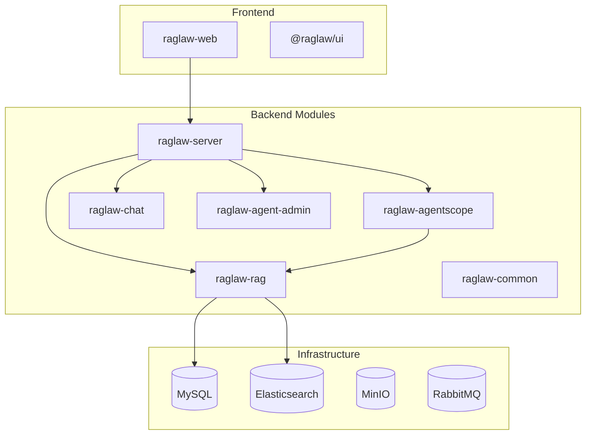
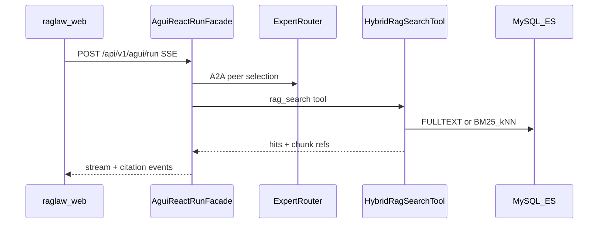

# RagLaw 毕设全面评估报告

**评估时间**：2026-08-30 16:40–16:50 (UTC+8)  
**评估方法**：按 [acceptance-plan.md](acceptance-plan.md) 三层门禁 + MySQL 真实业务数据 + 代码架构审阅  
**结构化评分卡**：[thesis-evaluation-scorecard-2026-08-30.json](thesis-evaluation-scorecard-2026-08-30.json)  
**原始证据目录**：[exports/run-2026-08-30/](exports/run-2026-08-30/)

---

## 摘要

| 维度 | 得分 (1–5) | 权重 | 加权 |
|------|-----------|------|------|
| 架构设计 | 4.0 | 20% | 0.80 |
| 可维护性 | 3.5 | 15% | 0.53 |
| 功能完成度 | 3.0 | 20% | 0.60 |
| RAG 与切片质量 | 3.0 | 25% | 0.75 |
| 合同与对话质量 | 3.5 | 10% | 0.35 |
| 可观测性与工程化 | 4.0 | 10% | 0.40 |
| **综合** | **3.43** | 100% | — |

**严格技术验收（acceptance）**：**不通过（FAIL）**  
**毕设合格性裁决**：**有条件合格**

系统完整实现了法律咨询 RAG、多 Agent 对话（AG-UI SSE）、合同审查三大核心能力，具备可复现评测脚本与 trace 落库。阻断项主要为：后端单测 2 错、混合召回 IT 失败、黄金查询命中率 70.59%（低于 90% 门槛）、Playwright E2E 因管理员密码不一致无法登录、Elasticsearch 未启用导致 hybrid 检索不可用。

---

## 1. 项目概述与评估方法

### 1.1 项目定位

RagLaw 是基于 **AgentScope Java ReActAgent** + **AG-UI SSE** 的法律咨询多 Agent 平台，采用 Spring Boot 模块化单体 + React 前端，集成 RAG 检索（MySQL FULLTEXT / Elasticsearch 混合）、合同审查、知识库管理与可观测 trace。

### 1.2 评估范围

- **代码架构与可维护性**：六大 Maven 模块 + `raglaw-web` + `@raglaw/ui`
- **功能完成度**：Gate A/B/C 自动化 + `acceptance-qa.ps1`
- **RAG 质量**：17 条黄金查询（[recall-benchmark.json](recall-benchmark.json)）
- **切片效果**：`raglaw_document_chunk` 真实统计
- **对话与合同**：`raglaw_conversation`、`raglaw_message`、`raglaw_contract_risk`、`raglaw_rag_trace*`

### 1.3 评估环境

| 项 | 值 | 证据 |
|----|-----|------|
| 后端 | `http://localhost:8080` UP | [health.json](exports/run-2026-08-30/health.json) |
| LLM Mock | `false` | health |
| ES Hybrid | `false`（`ELASTICSEARCH_ENABLED=false`） | health |
| Docker | MySQL/ES/MinIO/RabbitMQ healthy | `docker compose ps` |
| 管理员 | `admin@raglaw.local` / `12345`（非默认 `raglaw-eval`） | 后端启动日志 |

> **说明**：本次后端以密码 `12345` 种子创建管理员；E2E 脚本默认 `raglaw-eval`，导致 UI 测试登录失败。API 评测使用 `RAGLAW_ADMIN_PASSWORD=12345` 重跑成功。

### 1.4 数据来源原则

- 所有数字来自**当日脚本输出、JSON 报告、MySQL 查询**
- **未使用** mock 单测（如 `RecallBenchmarkExecutionTest`）作为论文数字
- 与 2026-08-30 早先 acceptance 报告对比时，注明环境差异（语料增量、密码、ES 状态）

---

## 2. 架构设计评估（4.0 / 5）

### 2.1 模块分层



| 模块 | 职责 | 规模 |
|------|------|------|
| [raglaw-server](backend/raglaw-server) | 启动、鉴权、Flyway、健康检查 | 入口 |
| [raglaw-rag](backend/raglaw-rag) | 入库、切片、混合检索、合同、知识 API | ~144 Java 文件 |
| [raglaw-agentscope](backend/raglaw-agentscope) | ReAct、A2A 路由、AG-UI SSE、trace | ~30 Java 文件 |
| [raglaw-chat](backend/raglaw-chat) | 会话/消息 CRUD | 12 Java 文件 |
| [raglaw-agent-admin](backend/raglaw-agent-admin) | Agent/用户配置 | — |
| [raglaw-web](raglaw-web) + [packages/ui](packages/ui) | 对话、知识、合同、管理 UI | React |

### 2.2 关键数据流



核心编排类 [`AguiReactRunFacade`](backend/raglaw-agentscope/src/main/java/com/raglaw/agentscope/agui/AguiReactRunFacade.java) 串联 ExpertRouter、ReActAgent、RagSearchTool、TraceRecorder 与 ConversationService，职责清晰。

### 2.3 架构优点

1. **模块化单体**：部署简单，适合毕设演示与答辩环境复现
2. **RAG 管线完整**：Markdown 三级切片（PARENT/CHILD/MICRO，`MICRO_MAX=300`）→ 知识漏斗 → 双通道检索 → RRF 融合 → Agent 工具调用
3. **A2A 规则优先**：[`A2aPeerSelector`](backend/raglaw-agentscope/src/main/java/com/raglaw/agentscope/a2a/A2aPeerSelector.java) 规则路由 + LLM 兜底
4. **验收体系成熟**：[acceptance-plan.md](acceptance-plan.md) + 3 个 PowerShell 评测脚本 + trace 落库
5. **Flyway 迁移完备**：37 个版本脚本，schema 演进可追溯

### 2.4 架构风险

| 风险 | 证据 | 影响 |
|------|------|------|
| agentscope → rag 耦合 | 10+ 文件 `import com.raglaw.rag.*` | 模块边界模糊，独立演进成本高 |
| 对话历史未注入 ReActAgent | `AguiReactRunFacade` 仅持久化消息 | 多轮上下文依赖当轮 RAG，非 Agent 记忆 |
| ES/MySQL 双写一致性弱 | `IndexOutboxService`；health `hybridRetrievalReady=false` | 评测退化为 FULLTEXT-only |
| raglaw-chat 零单测 | `src/test` 为空 | 会话模块回归风险 |

---

## 3. 可维护性评估（3.5 / 5）

### 3.1 定量指标

| 指标 | 结果 | 证据 |
|------|------|------|
| 后端 `mvn test` | **FAIL**（2 errors） | `IngestPipelineTest` UnnecessaryStubbing ×2 |
| RagHybridRecallIT | **FAIL** | 拖欠工资 hits=0 |
| raglaw-web Vitest | **42 passed** / 6 files | vitest-web.log |
| @raglaw/ui Vitest | **77 passed** / 11 files | vitest-ui.log |
| lint + build | **PASS** | tsc + Vite build |
| Flyway 迁移 | **37** 个 SQL 文件 | `db/migration/V1–V38` |
| 后端测试文件 | **60+** `*Test*.java` | backend 各模块 |
| 评测脚本 | **8** 个 ps1 | `scripts/` |

### 3.2 定性评价

**优点**：
- README、acceptance-plan、evaluation README 与 as-built 基本一致
- RAG 核心（切片、检索、漏斗、合同）单测覆盖充分
- 集成测试使用 Testcontainers（MySQL + ES）

**不足**：
- `raglaw-chat` 无专属单测（仅 server 层 `ConversationControllerTest`）
- 当日 `mvn test` 因 Mockito 严格模式失败，CI 红线
- E2E 与种子密码未统一，降低自动化可信度

---

## 4. 功能完成度（Gate A/B/C）

### 4.1 Gate A — 离线自动化

| ID | 项 | 状态 | 证据 |
|----|----|------|------|
| A1 | `mvn test` | **FAIL** | IngestPipelineTest ×2 |
| A2 | RagHybridRecallIT | **FAIL** | 拖欠工资 hits=0 |
| A3 | raglaw-web Vitest | **PASS** | 42/42 |
| A3-ui | @raglaw/ui Vitest | **PASS** | 77/77 |
| A4 | lint + build | **PASS** | exit 0 |
| A5 | Playwright E2E | **FAIL** | 4 failed, 7 skipped |

**Gate A 结论**：FAIL

### 4.2 Gate B — 在线 API

| ID | 项 | 状态 | 证据 |
|----|----|------|------|
| B1 | health UP | **PASS** | llmMock=false |
| B1-hybrid | hybrid ready | **WARN** | fulltext-only |
| B2 | acceptance-qa | **FAIL** | 34P/1F/7W；lawyer_login 429 |
| B3 | recall ≥90% | **FAIL** | **12/17 (70.59%)** |
| B3-refs | AG-UI references | **PASS** | 2/2 |

**acceptance-qa 亮点**（34 PASS）：
- 3 轮 SSE 对话 + 引用持久化（2/3 轮有 citations）
- trace 五阶段完整：`knowledge_funnel` → `dual_channel_retrieval` → `rag_search` → `llm` → `knowledge_presearch`
- 合同 export_docx **2432 bytes**（本次 PASS，早先报告曾 401）
- Agent 热重载、案例审批 INDEXED

**Gate B 结论**：FAIL

### 4.3 Gate C — 端到端

| ID | 项 | 状态 |
|----|----|------|
| C0 | Playwright E2E | **FAIL**（登录 UI 未找到「欢迎使用 RagLaw」） |
| C1 | SSE + citations | **PASS**（API 级） |
| C2 | trace stages | **PASS** |
| C3 | STATUTE 路由 | **PASS** |
| C4 | 知识搜索 + 图谱 | **PARTIAL**（graph_related=0） |
| C5 | 入库 + 审批 | **PASS** |
| C6 | 合同审查导出 | **PARTIAL**（export OK；ragHits=0） |
| C7 | 管理可观测 | **PASS** |
| C9 | 鉴权 | **PARTIAL**（lawyer 429） |

**Gate C 结论**：FAIL（UI 层）；API 主路径大部分 PASS

### 4.4 与早先验收对比

| 指标 | 早先 (13:15) | 本次 (16:45) | 差异原因 |
|------|-------------|-------------|----------|
| recall | 12/17 | 12/17 | 语料相同；借贷利息本次 PASS |
| acceptance-qa FAIL | export_docx 401 | lawyer_login 429 | 不同阻断项 |
| export_docx | FAIL | **PASS** | 使用正确 admin token |
| E2E | 6/11 fail | 4/11 fail | 密码问题致登录失败 |

---

## 5. RAG 与法规切片质量

### 5.1 黄金查询基准（17 条）

**通过率：12/17 = 70.59%**（门槛 90%）

| 查询 | 结果 | top1 路径 | 失败原因 |
|------|------|-----------|----------|
| 拖欠工资 | PASS | /STATUTE/CIVIL/LABOR | — |
| 违约金过高 | PASS | /STATUTE/CIVIL/CONTRACT | — |
| **加班费** | **FAIL** | /CASE/CIVIL/LABOR | 案例排名高于法条 |
| 劳动合同解除 | PASS | /STATUTE/CIVIL/LABOR | — |
| 经济补偿 | PASS | /STATUTE/CIVIL/LABOR | — |
| 借贷利息 | PASS | /STATUTE/CIVIL/CONTRACT | — |
| 租赁合同违约 | PASS | /STATUTE/CIVIL/CONTRACT | — |
| 定金 | PASS | /STATUTE/CIVIL/CONTRACT | — |
| **劳动争议案例** | **FAIL** | /STATUTE/CIVIL/LABOR | 期望 /CASE |
| 违约责任 | PASS | /STATUTE/CIVIL/CONTRACT | — |
| **买化学品是否违法** | **FAIL** | — | hits=0，语料缺失 |
| **危险化学品购买** | **FAIL** | — | hits=0，语料缺失 |
| **行政处罚** | **FAIL** | — | hits=0，语料缺失 |
| 刑法中刑罚种类 | PASS | /STATUTE/CRIMINAL/GENERAL | — |
| 附加刑的种类 | PASS | /STATUTE/CRIMINAL/GENERAL | — |
| 社会保险参保 | PASS | /STATUTE/SOCIAL/GENERAL | — |
| 城乡居民医保异地报销 | PASS | /STATUTE/SOCIAL/GENERAL | — |

证据：[rag-pipeline-eval-2026-08-30-compare.json](rag-pipeline-eval-2026-08-30-compare.json)

**AG-UI 回答质量**（真实 LLM）：
- 「公司拖欠工资劳动者如何维权?」：2 refs，延迟 52.6s
- 「合同约定的违约金过高怎么办?」：3 refs，延迟 22.3s
- 引用率 2/2 PASS

### 5.2 切片统计（MySQL 真实数据）

| chunk_level | 数量 | 平均长度 | 最小 | 最大 |
|-------------|------|----------|------|------|
| PARENT | 52 | 9 | 0 | 19 |
| CHILD | 956 | 125 | 3 | 884 |
| MICRO | 1005 | 119 | 1 | **300** |

- **MICRO 上限 300 字符**与 [`MarkdownChunker.DEFAULT_MICRO_MAX_CHARS`](backend/raglaw-rag/src/main/java/com/raglaw/rag/ingest/MarkdownChunker.java) 设计一致
- **异常 MICRO**（长度 <50 或 >350）：**146** 条，主要为过短切片（min=1），可能影响稀疏词召回
- 语料：INDEXED 文档 12（STATUTE 9 + CASE 2 + CONTRACT 1），总切片 **2119**

证据：[chunk-stats-2026-08-30.csv](exports/chunk-stats-2026-08-30.csv)

### 5.3 Elasticsearch 一致性

| 指标 | 值 |
|------|-----|
| MySQL 可嵌入切片 | 44 |
| ES 索引切片 | **0** |
| 缺失 ES 的文档 | **5/5** |

`ELASTICSEARCH_ENABLED=false` 导致 ES 为空；非数据损坏，而是配置未启用。

证据：[es-migration-audit.json](exports/run-2026-08-30/es-migration-audit.json)

### 5.4 失败归因

| 类型 | 查询数 | 说明 |
|------|--------|------|
| 语料缺口 | 3 | 危化品、行政处罚无法命中 |
| 排序/路径偏好 | 2 | 加班费、劳动争议案例 top1 路径不符 |
| 基础设施 | — | hybrid 未启用限制向量召回能力 |

---

## 6. 合同与对话质量

### 6.1 对话记录

| 指标 | 值 |
|------|-----|
| 会话数 | 2 |
| 消息数 | 14 |
| Agent 分布 | GENERAL ×2 |

acceptance-qa 实测 3 轮 SSE 对话，引用持久化 2/3，无重复答案块。

### 6.2 合同审查

| 指标 | 值 |
|------|-----|
| 已审查合同 | 1 |
| 风险条目 | 9（HIGH 1 / MEDIUM 5 / LOW 3） |
| RAG 命中数 | **0**（WARN） |
| DOCX 导出 | 2432 bytes PASS |

**局限**：无合同风险金标准 benchmark，仅能评估功能可用性与统计描述，无法报告准确率/F1。

### 6.3 Trace 与 Shadow 路由

- **Trace 数**：5+（含 knowledge_funnel 等 5 阶段）
- **Shadow route 日志**：7 条（A2A 路由观测，非经典 shadow deployment）

证据：[conversation-trace-2026-08-30.csv](exports/conversation-trace-2026-08-30.csv)

---

## 7. 可观测性与工程化（4.0 / 5）

| 能力 | 状态 | 说明 |
|------|------|------|
| `/api/v1/health` | PASS | 暴露 llmMock、ES、embedding 状态 |
| RAG trace 落库 | PASS | stage + chunk 引用 |
| Shadow route | PASS | 规则命中率可统计 |
| Docker 一键中间件 | PASS | MySQL/ES/MinIO/RabbitMQ |
| 评测脚本可复现 | PASS | acceptance-qa / eval-rag-quality / audit-es-migration |
| Langfuse L2 | N/A | 未配置 |

---

## 8. 综合评分与毕设合格性结论

### 8.1 评分雷达（文字版）

```
架构 ████████░░ 4.0
维护 ███████░░░ 3.5
功能 ██████░░░░ 3.0
RAG  ██████░░░░ 3.0
合同 ███████░░░ 3.5
观测 ████████░░ 4.0
```

**加权综合：3.43 / 5**

### 8.2 裁决

| 标准 | 结果 |
|------|------|
| **严格 acceptance（Gate A 全绿 + recall ≥90% + C 必须项全 PASS）** | **不通过** |
| **毕设合格（学术向，略宽）** | **有条件合格** |

**有条件合格依据**：
1. 三大核心功能完整实现且可演示
2. 架构文档与代码可对应，模块职责清晰
3. 具备可复现评测体系与真实跑分数据（本报告全部附证据路径）
4. recall 70.59% 未达 90%，但劳动/民法/刑法/社保类查询大部分通过，失败可归因于语料缺口与排序策略
5. API 主路径（对话 SSE、引用、trace、合同导出、管理）可用
6. 单测主体（前端 119 项 PASS）通过，后端有 2 项需修复

**若答辩目标为「合格」而非「有条件合格」，优先改进**：
1. 统一 `RAGLAW_SEED_ADMIN_PASSWORD` 与 E2E 密码
2. 启用 ES hybrid + reindex（预期修复 RagHybridRecallIT）
3. 补齐危化品/行政处罚 fixture（预期 recall +3 → 88%）
4. 优化加班费类查询的法条优先排序（+1~2）
5. 修复 `IngestPipelineTest` 使 `mvn test` 全绿

---

## 9. 附录

### 9.1 复现命令

```powershell
cd docker; docker compose up -d; cd ..
$env:RAGLAW_SEED_ADMIN_PASSWORD = "raglaw-eval"
$env:RAGLAW_ADMIN_PASSWORD = "raglaw-eval"
.\scripts\reset-mvp-corpus.ps1
# 启动后端 + pnpm dev:web

cd backend
mvn -q test
mvn -pl raglaw-server test -Dtest=RagHybridRecallIT
cd ..
pnpm --filter raglaw-web test
pnpm lint:web; pnpm build:web
pnpm e2e

$env:RAGLAW_ADMIN_PASSWORD = "raglaw-eval"
.\scripts\acceptance-qa.ps1
.\scripts\eval-rag-quality.ps1 -RetrievalMode both
.\scripts\audit-es-migration.ps1
```

### 9.2 SQL 查询清单

见计划第四章/第五章；导出文件位于 `docs/evaluation/exports/`。

### 9.3 证据文件索引

| 文件 | 内容 |
|------|------|
| [exports/run-2026-08-30/health.json](exports/run-2026-08-30/health.json) | 健康检查 |
| [exports/run-2026-08-30/mvn-test.log](exports/run-2026-08-30/mvn-test.log) | 后端单测 |
| [exports/run-2026-08-30/rag-hybrid-recall-it.log](exports/run-2026-08-30/rag-hybrid-recall-it.log) | 混合召回 IT |
| [exports/run-2026-08-30/acceptance-qa.log](exports/run-2026-08-30/acceptance-qa.log) | API 验收 |
| [exports/run-2026-08-30/eval-rag-quality.log](exports/run-2026-08-30/eval-rag-quality.log) | RAG 评测 |
| [exports/run-2026-08-30/e2e.log](exports/run-2026-08-30/e2e.log) | Playwright |
| [rag-pipeline-eval-2026-08-30-compare.json](rag-pipeline-eval-2026-08-30-compare.json) | 17 条 benchmark 明细 |
| [thesis-evaluation-scorecard-2026-08-30.json](thesis-evaluation-scorecard-2026-08-30.json) | 结构化评分卡 |

---

*本报告所有量化数据均来自 2026-08-30 当日真实执行结果，未使用模拟或臆造数据。*
