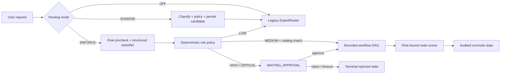

# Risk-aware routing and workflow architecture

The legacy `ExpertRouter` remains the request execution authority. Routing mode is configured as `OFF`, `SHADOW` (the default), or `ENFORCE`.



- `OFF` leaves the legacy expert/tool/response path untouched.
- `SHADOW` evaluates classification and policy, persists candidate decisions and trace evidence asynchronously, but never replaces the selected expert or executes a workflow.
- `ENFORCE` applies the deterministic risk policy before expert/tool resolution. High and critical paths require the declared execution mode and fail closed when workflow or required materials are unavailable.

Workflow execution is represented as a catalog-matched DAG. Nodes carry required roles/materials and are cancellable; human-gated transitions persist a waiting state and require explicit approval before continuation. Missing workflow definitions, unavailable adapters, malformed classifier output, and policy errors remain fail-closed rather than silently executing.

Audit data is split between route-decision rows (`raglaw_task_route_decision`), workflow run/node tables, and trace stages. A shadow trace stage records candidate task type, risk, execution mode, agreement, classifier latency, provenance versions, and safe error codes. Query text and legal document contents are not copied into route-decision JSON.

Typical trace sequence:

```text
expert_router -> task_route_shadow -> llm/rag stages -> workflow gate (ENFORCE only) -> complete
```
