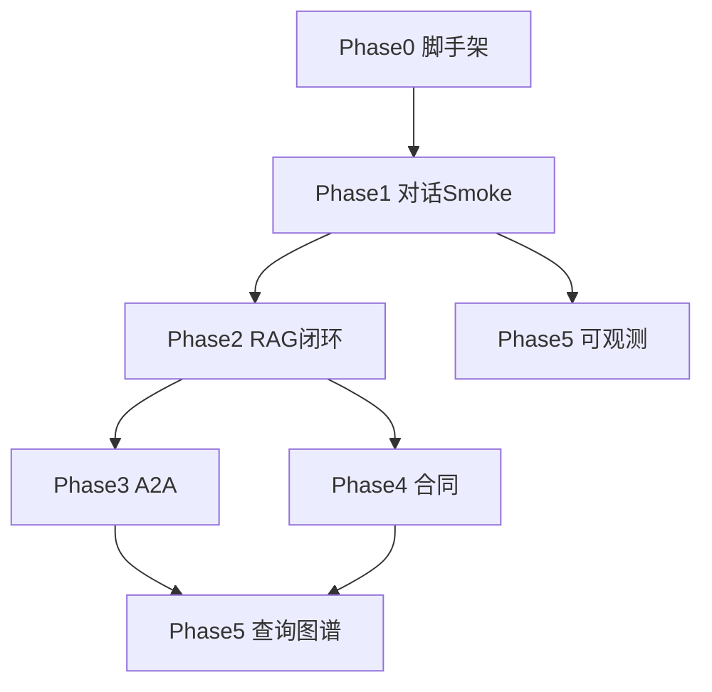

# RagLaw 完整实现任务清单

> **For agentic workers:** REQUIRED SUB-SKILL: Use `superpowers:subagent-driven-development` or `superpowers:executing-plans` task-by-task. Steps use `- [ ]` checkboxes.

**Goal:** 从零搭建 RagLaw monorepo：多 Agent 法律咨询平台（AgentScope + CopilotKit/AG-UI + RAG + 合同审查 + L1/L2 可观测）。

**Architecture:** 模块化单体 `raglaw-server`（chat/agentscope/rag/agent-admin）；`raglaw-web` 单应用 RBAC；MySQL 业务+会话+trace；pgvector 向量；MinIO 原件；RabbitMQ 入库。

**Tech Stack:** Java 17, Spring Boot 3, AgentScope Java 2.0, DashScope, React 19, Vite, CopilotKit, AG-UI, MySQL 8, pgvector, MinIO, RabbitMQ, Redis, Langfuse (profile), Playwright.

**Spec:** [法律咨询agent平台_46d21b47.plan.md](c:\Users\lllude\.cursor\plans\法律咨询agent平台_46d21b47.plan.md)

## Global Constraints

- 仓库名：**RagLaw**；pnpm workspace；Java 模块 `raglaw-*`
- 仅本地 Docker；无 K8s
- 默认模型 **qwen-plus**；合同/复杂任务 **qwen-max**
- Embedding：**text-embedding-v3**（1024 维）
- JWT：Access 2h + Refresh 7d（HttpOnly）
- 首管：`admin@raglaw.local` Docker 首次启动种子，密码打日志
- Agent 改配置后 **手动** `POST /admin/agents/reload`
- 重新生成：**追加** assistant 消息
- 可观测：**L1 MySQL trace + L2 Langfuse** 双写，`langfuse_trace_id` 关联

---

## Phase 0 — 仓库与基础设施（前置，~2 天）

### Task 0.1 Monorepo 脚手架

**Files:**
- Create: `RagLaw/pnpm-workspace.yaml`, `package.json`
- Create: `RagLaw/raglaw-web/`, `RagLaw/packages/ui/`
- Create: `RagLaw/backend/pom.xml`（parent）
- Create: `RagLaw/backend/raglaw-server/`, `raglaw-common/`, `raglaw-chat/`, `raglaw-agentscope/`, `raglaw-agent-admin/`, `raglaw-rag/`
- Create: `RagLaw/docker/docker-compose.yml`
- Create: `RagLaw/.env.example`, `RagLaw/README.md`

- [ ] 初始化 pnpm workspace（`raglaw-web`, `packages/ui`）
- [ ] 初始化 Maven 多模块 parent + 6 子模块，统一 Java 17
- [ ] `docker-compose.yml`：mysql, postgres(pgvector), minio, rabbitmq, redis + named volumes
- [ ] `docker-compose` profile `observability`：langfuse + langfuse-db
- [ ] `.env.example`：DASHSCOPE_API_KEY, JWT_SECRET, MYSQL_*, MINIO_*, LANGFUSE_*

**Verify:** `docker compose up -d` 全部 healthy；`mvn -q -pl backend/raglaw-server validate`

---

### Task 0.2 数据库 Schema 种子

**Files:**
- Create: `docs/sql/mysql/001_schema.sql`（user, conversation, message, category, document, chunk, agent_config, approval, trace 表）
- Create: `docs/sql/mysql/002_seed_category.sql`（L1/L2 类目）
- Create: `docs/sql/mysql/003_seed_agents.sql`（GENERAL, STATUTE_*, CONTRACT_GENERAL 等）
- Create: `docs/sql/postgres/001_vector.sql`（pgvector extension + embedding 表）

- [ ] MySQL schema：含 FULLTEXT ngram 索引说明（`ngram_token_size=2`）
- [ ] 关系表：`statute_ref`, `case_statute_ref`
- [ ] pgvector 表：`chunk_id`, `vector(1024)`, `l1_path`, `l2_path`, `l3_path`

**Verify:** 挂载 SQL 到 MySQL init；`\dx` 在 PG 可见 vector

---

## Phase 1 — 骨架、鉴权、对话 Smoke（2–3 周）

### Task 1.1 raglaw-common + JWT/RBAC

**Files:**
- `backend/raglaw-common/`：ApiResponse, ErrorCode, JwtUtils, UserPrincipal
- `backend/raglaw-server/`：SecurityFilterChain, JwtAuthFilter, CorsConfig

- [ ] 用户表 Entity + `UserRepository`（BCrypt）
- [ ] `POST /api/v1/auth/login`, `/refresh`, `/logout`, `GET /me`
- [ ] `DemoAdminInitializer`：首次启动创建 admin@raglaw.local
- [ ] RBAC：`ROLE_LAWYER`, `ROLE_ADMIN`；`/api/v1/admin/**` 需 ADMIN

**Verify:** curl login 拿 access token；LAWYER 访问 `/admin` API 返回 403

---

### Task 1.2 会话 API（MySQL）

**Files:**
- `backend/raglaw-chat/`：ConversationController, ConversationService, MessageMapper

- [ ] `GET/POST /conversations`, `GET/PATCH/DELETE /conversations/{id}`
- [ ] `GET /conversations/{id}/messages`
- [ ] 标题异步 LLM 摘要（首条 user 消息后）

**Verify:** 创建会话 → 存消息 → 列表可见标题

---

### Task 1.3 AgentScope 最小运行时 + AG-UI/SSE

**Files:**
- `backend/raglaw-agentscope/`：AgentRegistry, AgentConfigLoader, AguiController
- `backend/raglaw-agent-admin/`：AgentConfig CRUD + reload

- [ ] 引入 AgentScope Java 2.0 + DashScope starter
- [ ] 启动加载 `enabled` Agent；`POST /admin/agents/reload`
- [ ] 注册 `GENERAL` + `STATUTE_CIVIL`（示例）+ `rag_search` Tool（mock 返回）
- [ ] `POST /api/v1/agui/run` → SSE（meta, status, text, done）
- [ ] `POST /api/v1/agui/run/stop?taskId=`

**Verify:** curl SSE 能收到流式 text；stop 可中断

---

### Task 1.4 L1 Trace 基础写入

**Files:**
- `backend/raglaw-agentscope/trace/TraceRecorder.java`
- 表：`rag_trace`, `rag_trace_stage`, `llm_usage_log`

- [ ] 每次问答写 trace_id；记录 agent_code, latency, tokens
- [ ] AgentScope streamEvents 消费骨架

**Verify:** 问答后 MySQL `rag_trace` 有记录

---

### Task 1.5 raglaw-web Shell + CopilotKit

**Files:**
- `packages/ui/`：Sidebar, ThemeToggle, LayoutShell
- `raglaw-web/`：router, auth store, login page
- 路由：`/`, `/admin/agents`（ADMIN only）

- [ ] Script 风格侧栏：智能对话 / 合同审查 / 法规案例查询
- [ ] ADMIN 额外菜单：Agent 配置 / 类目 / 审批 / 用户 / 可观测性
- [ ] CopilotKit Provider → `POST /api/v1/agui/run`
- [ ] 欢迎页 + 4 快捷卡片

**Verify:** 登录 → 发一条消息 → 流式显示

---

### Task 1.6 Playwright Smoke

**Files:**
- `raglaw-web/e2e/smoke.spec.ts`

- [ ] 登录 admin → 发一条对话 → 断言有 assistant 回复
- [ ] CI 本地脚本：`pnpm e2e`

**Verify:** `pnpm e2e` 绿

---

## Phase 2 — 知识闭环（2–3 周）

### Task 2.1 类目树 CRUD

**Files:**
- `backend/raglaw-rag/CategoryController`, `CategoryService`
- `raglaw-web/src/pages/admin/Categories.tsx`

- [ ] L1/L2/L3 CRUD；种子数据导入
- [ ] `knowledgeScopes` 展开 L2→L3 叶子 API

**Verify:** admin 创建 L3 专题；Agent 配置可勾选

---

### Task 2.2 入库流水线

**Files:**
- `backend/raglaw-rag/ingest/`：UploadController, ParseConsumer, IndexConsumer
- MinIO：`rag/original/{docId}/...`

- [ ] 选 L3 + 上传 → MinIO → RabbitMQ parse
- [ ] Tika 解析；父子块切片（法规条/款，案例段落）
- [ ] 向量化 DashScope embedding → pgvector
- [ ] 状态机：PENDING → INDEXED / AWAITING_APPROVAL

**Verify:** 上传 md 法规 → pgvector 有向量；chunk MySQL 有记录

---

### Task 2.3 审批流

**Files:**
- `ApprovalController`, `raglaw-web/admin/Approvals.tsx`

- [ ] LAWYER 案例 → AWAITING_APPROVAL
- [ ] ADMIN approve → index；reject → REJECTED + 原因
- [ ] 驳回后可重提

**Verify:** 律师上传 → 待审批 → 批准后可被 RagTool 命中

---

### Task 2.4 RagTool 真实检索

**Files:**
- `backend/raglaw-rag/retrieval/HybridRetriever.java`（pgvector + MySQL FULLTEXT RRF）
- `backend/raglaw-agentscope/tools/RagSearchTool.java`

- [ ] scopes 由 Agent knowledgeScopes 注入，模型不可越权
- [ ] 仅 `INDEXED` 文档参与检索
- [ ] 删除/驳回同步删 pgvector

- [ ] 单元测试：RRF 融合、类目过滤

**Verify:** 对话引用返回真实 chunk；引用卡片数据 `reference` SSE 事件

---

## Phase 3 — 多 Agent + A2A（1–2 周）

### Task 3.1 预置专家 Agent 种子

- [ ] STATUTE_{8个法规领域}, CASE_{4}, CONTRACT_{4} + CONTRACT_GENERAL
- [ ] GENERAL `a2aPeers` 白名单配置 UI

**Verify:** admin 可启用/禁用各 Agent

---

### Task 3.2 A2A 编排

**Files:**
- `backend/raglaw-agentscope/a2a/A2aOrchestrator.java`
- 表：`a2a_call_log`

- [ ] GENERAL ReAct 调用 peer Agent
- [ ] SSE `status`：「正在咨询法规助手…」
- [ ] 汇总 peer 结果流式返回

**Verify:** 劳动问题触发 STATUTE 劳动领域 Agent；`a2a_call_log` 有记录

---

### Task 3.3 前端专家入口 + 引用跳转

- [ ] 路由 `/chat/:agentCode`
- [ ] 引用卡片脚注 [1][2] + 跳转 `/knowledge/statutes|cases/:id`
- [ ] AnswerActions：复制 / 重新生成（追加）/ 问题推荐（LLM `recommend` 事件）

**Verify:** 专家页直连；引用可点开详情（空库时 404 可接受）

---

## Phase 4 — 合同审查（2–3 周）

### Task 4.1 合同上传与 OCR

**Files:**
- `ContractController`, `DashScopeOcrClient`, `ContractDocument` entity

- [ ] 上传 PDF → DashScope OCR / pdfbox 坐标
- [ ] LLM 分类 → `CONTRACT_{domain}`；失败回退 CONTRACT_GENERAL

**Verify:** 扫描件提取文本；分类结果写入 document metadata

---

### Task 4.2 风险标注与高亮 UI

**Files:**
- `raglaw-web/pages/contracts/`：ContractViewer (react-pdf), RiskPanel
- Skill：`risk-dimension-review`

- [ ] `RiskAnnotation` 结构；右栏风险清单（严重程度/维度）
- [ ] PDF 叠加高亮层

**Verify:** 上传合同样本 → 可见高亮 + 风险列表

---

### Task 4.3 修订采纳与导出

- [ ] CopilotKit `acceptAllRevisions` clientTool
- [ ] 后端生成 DOCX + PDF 修订版

**Verify:** 一键采纳 → 下载两种格式

---

### Task 4.4 合同对话审查

- [ ] 合同 `documentId` 绑定 conversation
- [ ] 针对单条款追问上下文

**Verify:** 合同页对话能引用当前合同条款

---

## Phase 5 — 查询、图谱、可观测完整版（1–2 周）

### Task 5.1 法规/案例查询页

**Files:**
- `raglaw-web/pages/knowledge/Statutes.tsx`, `Cases.tsx`, `Detail.tsx`

- [ ] 关键词 + L1/L2 筛选 + 分页
- [ ] 原件 MinIO 预览/下载

**Verify:** 入库文档可搜索并打开详情

---

### Task 5.2 知识图谱（React Flow）

- [ ] 入库/LLM 写 `case_statute_ref`；管理员手工补链 API
- [ ] 详情页中部 React Flow 图谱；右侧关联法条列表

**Verify:** 有关系的案例详情展示图谱节点

---

### Task 5.3 L1 可观测性面板

**Files:**
- `raglaw-web/pages/admin/Observability.tsx`

- [ ] 概览 / Trace 列表 / Trace 详情瀑布图 / Chunk 检查
- [ ] 跳转 Langfuse 外链

**Verify:** 一次问答可在面板还原 A2A + chunks

---

### Task 5.4 L2 Langfuse 集成

**Files:**
- `backend/raglaw-agentscope/trace/LangfuseBridge.java`

- [ ] Langfuse Java SDK 埋点 LLM/Tool/A2A span
- [ ] `langfuse_trace_id` 写入 `rag_trace`
- [ ] `docker compose --profile observability up` 文档

**Verify:** Langfuse UI 可见 trace；与 L1 id 关联

---

### Task 5.5 收尾

- [ ] 免责声明 footer（对话/合同页）
- [ ] 深色主题 toggle
- [ ] 移动端基础适配
- [ ] `docs/API.md` 完整
- [ ] `docs/backup.md`（mysqldump + volume）

**Verify:** §17 验收标准 1–10 全通过

---

## 依赖关系图

**可并行：** Phase 4 前端 PDF 组件可在 Phase 2 后期启动；Langfuse（5.4）可在 Phase 1 trace 骨架后立即接入。

---

## 风险与缓解

| 风险 | 缓解 |
|---|---|
| AgentScope + CopilotKit 集成复杂 | Phase 1 先原生 SSE，再包 CopilotKit |
| 合同 PDF 高亮坐标难 | 先做文本级高亮，坐标级迭代 |
| 工期 10–14 周偏紧 | 严格按 Phase 验收，不超前做 Phase 5 美化 |
| 空库演示效果差 | README 提供 1 份示例法规 md 可选导入 |

---

## 文档一致性修复（开工时同步）

- [ ] 全文 `lawyer-web`/`admin-web` → `raglaw-web` + `/admin/*`
- [ ] 合同 mermaid 图改为 LLM 自动识别
- [ ] 计划章节补 §16 或重编号 §17→§16
