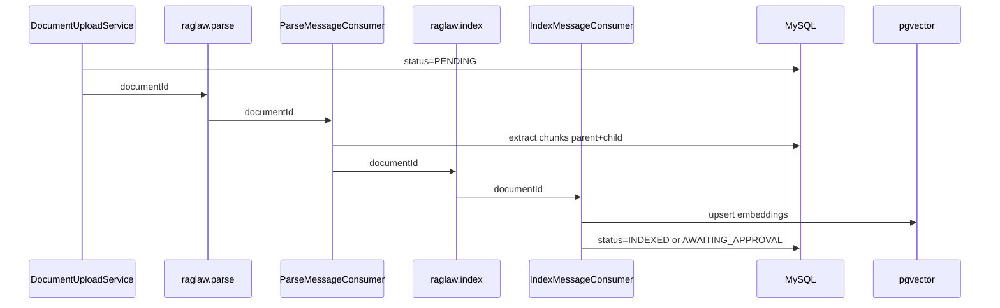

# 异步入库完整管线 Design Spec

**Date:** 2026-08-23  
**Status:** Approved for implementation planning  
**Scope:** H3 — RabbitMQ 多阶段队列、父子块切片、文档状态机

## Goal

将文档上传后的解析、分块、向量化从同步 `IngestService.ingest()` 拆分为可观测的异步管线，在 `RABBITMQ_ENABLED=true` 时默认走队列；`false` 时保留同步全链路以便本地开发。

## Current State

- [`DocumentUploadService`](backend/raglaw-rag/src/main/java/com/raglaw/rag/service/DocumentUploadService.java)：单队列 `raglaw.parse` 或同步 ingest
- [`ParseMessageConsumer`](backend/raglaw-rag/src/main/java/com/raglaw/rag/messaging/ParseMessageConsumer.java)：消费后直接 `ingestService.ingest()`
- [`MarkdownChunker`](backend/raglaw-rag/src/main/java/com/raglaw/rag/ingest/MarkdownChunker.java)：平铺段落，`parent_id` 恒为 null
- [`IngestService`](backend/raglaw-rag/src/main/java/com/raglaw/rag/service/IngestService.java)：解析+分块+embedding+状态更新一体

## Target Architecture

## Decisions

| Topic | Decision |
|-------|----------|
| 队列 | `raglaw.parse`（解析+分块）→ `raglaw.index`（embedding+向量写入） |
| 消息体 | `documentId` 字符串（与现有一致） |
| 失败重试 | Spring AMQP 默认重试 3 次；超限进 DLQ `raglaw.parse.dlq` / `raglaw.index.dlq` |
| 父子块 | parent：章节/条标题块；child：可检索叶子（法规条、案例段落、合同条款） |
| CASE 审批 | 解析后 `AWAITING_APPROVAL`；INDEX 阶段在 approve 后触发（或 parse 阶段即写块、index 跳过未批准） |
| 同步降级 | `RABBITMQ_ENABLED=false` 调用 `IngestPipeline.sync(documentId)` 等价执行 parse+index |
| 上传响应 | 立即返回 `PENDING`；Admin 文档列表展示状态；可选轮询 `GET /admin/documents/{id}` |

## Parent-Child Chunking Rules

1. **STATUTE / CONTRACT markdown**：按 `##` / `###` 标题切 parent；段落为 child，`parent_id` 指向 parent chunk
2. **CASE markdown**：`##` 节为 parent，段落为 child
3. **PDF/DOCX（Tika 输出）**：按双换行段落为 child；每 5 段合并一个虚拟 parent（MVP）
4. 检索仍面向 **child**；parent 用于 UI 折叠与 inline 修订锚点（H4）

## Data Model Changes

- `raglaw_document_chunk.parent_id`：已有列，开始写入
- 可选 `raglaw_document.ingest_stage`：`PENDING` / `PARSING` / `INDEXING` / `FAILED`（Flyway V13）
- 失败原因写入现有 `reject_reason` 或新列 `ingest_error`

## API / Config

- `raglaw.rag.rabbit.index-queue: raglaw.index`
- Health：`rag.rabbitEnabled` + 可选 `rabbitQueuesReachable`
- `.env.example`：文档说明 dev 可 `RABBITMQ_ENABLED=true`

## Out of Scope (this spec)

- 多 worker 水平扩展调优
- OCR 坐标级分块
- Admin 重试按钮（后续）

## Success Criteria

1. 上传 PDF → 状态经 PENDING → INDEXED，pgvector 有对应行
2. `parent_id` 非空率 > 0 对 fixture 法规文档
3. Rabbit 关闭时同步路径仍通过 `mvn test`
4. 失败消息进入 DLQ 且不无限重试

## Spec References

- Implementation plan: [`docs/superpowers/plans/2026-08-23-async-ingest-pipeline.md`](../plans/2026-08-23-async-ingest-pipeline.md)
