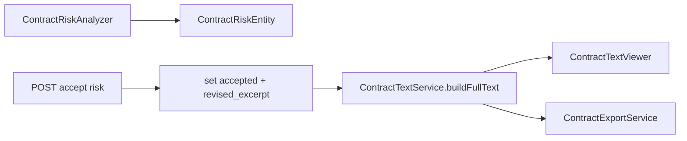

# 合同条款级 Inline 修订 Design Spec

**Date:** 2026-08-23  
**Status:** Approved for implementation planning  
**Scope:** H4 — chunk 级修订替换、持久化、导出

## Goal

用户「采纳」风险修订后，修改反映在合同正文的对应 chunk 中（inline），而非仅在文末追加附录；导出 DOCX/PDF 使用修订后正文。

## Current State

- [`ContractTextService.buildRevisedText()`](backend/raglaw-rag/src/main/java/com/raglaw/rag/contract/ContractTextService.java)：全文 + 附录 `## 修订建议（已采纳）`
- [`ContractRiskEntity`](backend/raglaw-rag/src/main/java/com/raglaw/rag/domain/ContractRiskEntity.java)：`accepted` boolean
- 无 replacement 文本字段

## Decisions

| Topic | Decision |
|-------|----------|
| MVP 修订模型 | **Suggestion-as-replacement**：采纳后将 chunk 内 `excerpt` 子串替换为 `suggestion` 文本（规则风险已有 suggestion） |
| 持久化 | `raglaw_contract_risk.revised_excerpt TEXT NULL`；采纳时写入；取消采纳清空 |
| 展示 | `buildFullText()` 拼接 chunks 时，若 risk.accepted 且 revised_excerpt 非空，用 revised 替换原 chunk 中 excerpt 段 |
| PDF 合同 | 文本侧 inline；PDF 预览仍基于提取文本高亮（不修改 PDF 二进制） |
| 导出 | `ContractExportService` 使用 `buildRevisedText()` 新逻辑（无附录段） |
| LLM 生成 replacement | Out of scope MVP；后续可增 `POST /risks/{id}/generate-revision` |

## Revision Flow



## revised_excerpt 计算（MVP）

```java
String revised = chunkContent.replaceFirst(Pattern.quote(excerpt), suggestion);
```

若 excerpt 不在 chunk 中，则 `revised_excerpt = chunkContent + "\n【建议】" + suggestion`

## API

- 现有 `POST .../risks/{id}/accept` 扩展：写入 `revised_excerpt`
- 新增 `POST .../risks/{id}/unaccept`（可选 MVP）：清除 accepted + revised_excerpt
- `GET .../text` 返回修订后 `content`

## Frontend

- 采纳后刷新 text API 或乐观更新 `content`
- 文本视图：`<del>` 原文 + `<ins>` 建议（CSS 在 components.css）
- PDF 视图：仍跳页高亮（H2）

## Success Criteria

1. 采纳一条风险后，合同正文中对应段落可见修订（非仅附录）
2. 导出 DOCX 不含「修订建议（已采纳）」附录标题
3. `accept-all` 批量采纳所有风险的 inline 效果

## Out of Scope

- 版本历史 / 修订轨迹审计
- 与对方律师协同批注
- CopilotKit clientTool

## Spec References

- Implementation plan: [`docs/superpowers/plans/2026-08-23-contract-inline-revision.md`](../plans/2026-08-23-contract-inline-revision.md)
